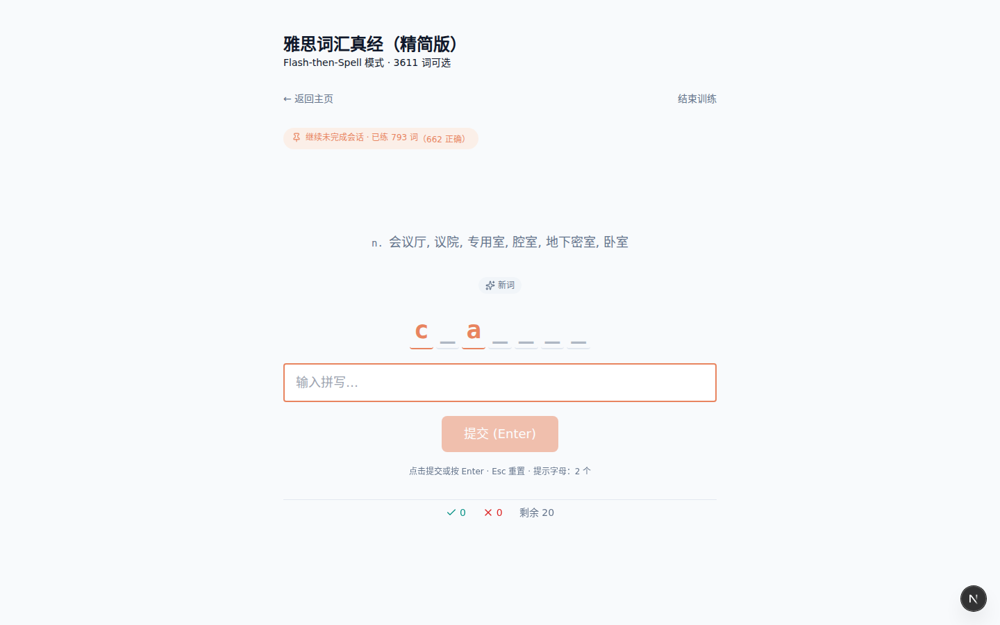
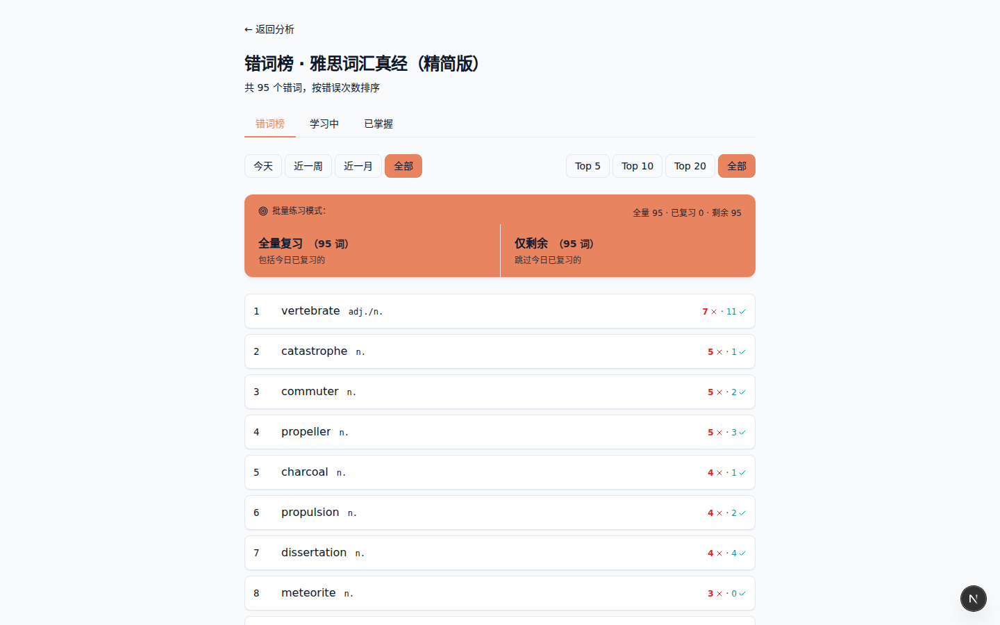
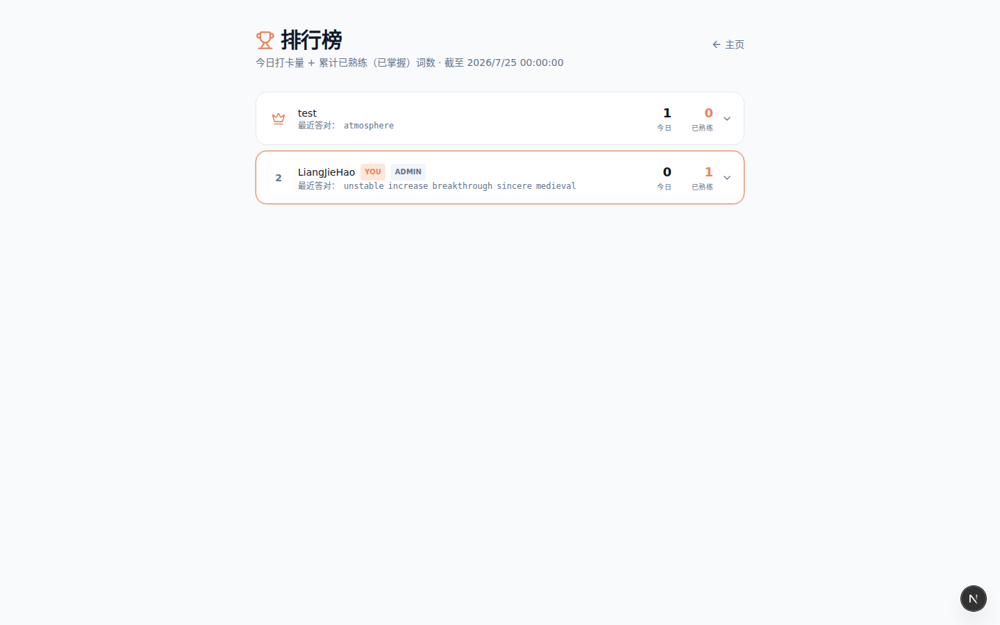
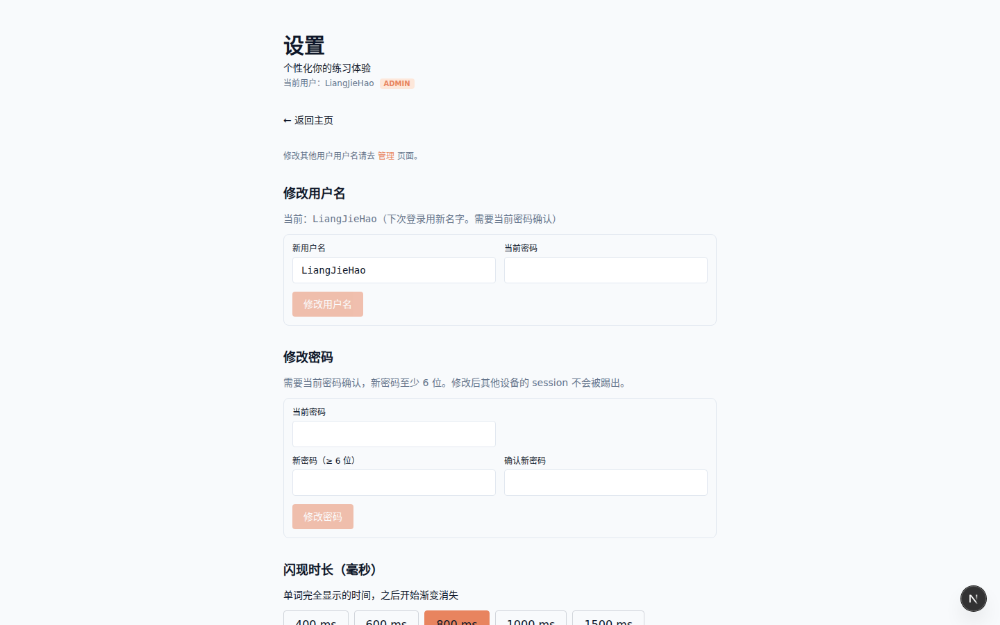
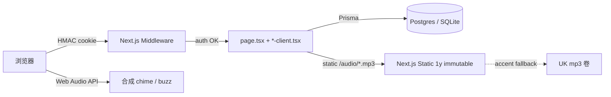

# Yasi Words · 雅思单词拼写训练器

[](https://github.com/meisijiya/IELTS_WORDS/actions/workflows/ci.yml)
[](https://github.com/meisijiya/IELTS_WORDS/pkgs/container/ielts_words)
[](LICENSE)
[](https://nextjs.org)
[](https://www.typescriptlang.org)
[](https://www.prisma.io)

> 为雅思机考的键盘操作习惯设计的本地优先单词训练工具，闪卡 + 拼写 + 双口音真人发音。
> 3 个词库（精简 3611 / 完整 7076 / CET-6 5518），HMAC cookie 多用户隔离，GH Actions 自动 deploy 到云端。

为雅思考生打造的键盘友好型单词训练工具：从闪卡到拼写，键盘不离手；从真人发音到 streak 连击音效，把枯燥的「背单词」变成肌肉记忆训练。**无限副本模式**：用户主导无限学习，**没有「每日单词量」限制**，手动结束会话；新词进入学习队列后会在后续 5 倍次出现以巩固。

整套仓库走 **「schema 是数据模型唯一源 + 解析 / 种子 / 审计三件套」** 的工程闭环：词源 PDF → 双引擎解析 → cross-validate → seed JSON → Prisma migrate → 浏览器。

适用人群：雅思机考考生（键盘拼写场景）、CET-6 应试者、想用间隔重复巩固词汇的英语学习者。**本地优先**：所有数据存自有 Postgres，无第三方追踪，无广告，可私有部署。

工程原则：**schema 是数据契约**（改 `prisma/schema.prisma` 必须 expand-and-contract）、**测试是守卫**（vitest 单测 + pytest parser + 数据 gate 三层）、**回滚永远可执行**（image 双 buffer + 数据库每日快照）。

**为什么做这个**：市面背单词 App 大多是「认单词 + 选义」，但雅思机考的真正痛点是「听到词 → 在键盘上拼出来」；闪卡 + 拼写 + 真人发音的组合更贴近考场。

**速览命令**：`npm run dev` 启动开发 · `npm test` 跑单测 · `npm run gate` 验证数据准确率 · `docker compose up -d --build` 一键起容器。

## 一图胜千言

```
┌─ 请求链路 ─────────────────────────────────────────────────────────┐
│ 浏览器 ─▶ Next.js App (Edge + Node) ─▶ Prisma ─▶ Postgres        │
│             │                            │                        │
│             ├─ Web Audio API             └─ named volume          │
│             └─ /audio/*.mp3 (1y immutable cache, audio_data 卷)  │
└──────────────────────────────────────────────────────────────────┘
```

整套请求链路：浏览器发起拼写请求 → Next.js App Router 走 HMAC cookie 鉴权 → Prisma ORM 按 userId 隔离读写 Postgres；音频走 Next.js 静态目录 `/audio/*`，一年 immutable 缓存，浏览器永久命中，零重复请求。

**edge / node 双 runtime**：middleware 在 Edge 验签 cookie 防 CSRF，page / API 跑 Node 调 Prisma。容器启动时若 baked audio 缺失，`entrypoint.sh` 会 runtime 兜底从 `AUDIO_BUNDLE_URL` 拉到 `audio_data` named volume，无需 reload image 即可恢复。

**鉴权链路**：Web Crypto HMAC 签名 cookie，userId + role 嵌入 payload，篡改即失效。`requireUser()` 是所有受保护 page / API 的统一守卫，page 与 API 双重校验防止绕过。`hashPassword` / `verifyPassword` 用 PBKDF2-SHA-256 100k iters。

**数据隔离**：所有 per-user 表（Session / Attempt / Checkin / UserWord / UserSettings）查询都带 `where: { userId }`，跨用户读不到一行。`UserSettings.userId` 是 `@unique`。

**音频存储**：238 MB / 20194 个 mp3 镜像构建时通过 `AUDIO_BUNDLE_URL` 烤入，BuildKit cache 故意关闭（避免 stale layer 吞掉音频更新）。缺失时 runtime fallback 到 `audio_data` named volume。`accent` 自动 fallback（US 词缺失时顶上 UK）。

**部署简图**：GH Actions runner 推 ACR → SSH server `docker compose up -d --force-recreate app` → 保留当前 + 上一个 image 作回滚 buffer → 每日 `pg_dump | gzip` 备份 14 天。

完整设计文档与截图：[GitHub Pages](https://meisijiya.github.io/IELTS_WORDS/) · [架构大图 SVG](project-page/assets/diagrams/architecture.svg) · [CI/CD 教科书](https://meisijiya.github.io/IELTS_WORDS/cicd/)

## 核心特性

| 图标 | 特性 | 说明 |
|---|---|---|
| 🎯 | Flash-then-Spell 闪卡拼写 | 显示中英文 → 英文渐变消失 → 键盘拼写，贴合真实机考节奏 |
| 📚 | SM-2 简化记忆曲线 | level 0–5 升降级；连对 5 次升 mastered，答错即 de-master 重学 |
| ⚡ | US/UK 双口音真人发音 | 20194 个 mp3 烤入镜像，1 年 immutable 缓存，accent 缺失自动 fallback |
| 🔒 | 多用户数据隔离 | HMAC 签名 cookie + 全表 `userId` 隔离，admin 邀请码 7 天有效 |

**训练闭环**：每张词卡经过「闪卡 → 拼写 → 双口音播放 → 音效反馈」四步。新词给 2 字母提示、复习词给 1 字母提示、已熟练不提示，渐进式降低辅助，让拼写本身形成肌肉记忆。

**拉取节奏**：三档优先级（review / balanced / new）覆盖巩固期、平稳期、扩张期。每 batch 20 词按比例混搭：review 4 新 + 8 学过 + 8 已熟练（默认复习密集）；balanced 14 新 + 5 学过 + 1 已熟练；new 18 新 + 2 学过 + 0 已熟练（扩张密集）。queue < 5 时静默 fetch 下一页，单 batch < 100 KB。

**视听反馈**：答对 `Web Audio API` 双音 ding，答错双音 buzz；streak 在 3 / 6 / 9 / 12 / 15 milestone 升级音色（双音 → bell → sparkle → swell + 合弦），milestone 触发 banner pulse + 1–4 px 屏幕微震（≤ 120 ms，不干扰学习）。

**错题榜系统**：错题 Session 走 mode='review'，**只插 Attempt 行不修改 Word 状态**（attempts / level / masteredAt 不变）。错词榜按错误次数排序，时间筛选（今日 / 一周 / 一月 / 全部），展开行显示 30 天每日正确率曲线 + 单练入口 + 标记已熟按钮。今日已复习 badge 仅 mode='review' 触发，drill 错词 attempt 不算复习。

**多用户与邀请码注册**：admin 在 `/admin/invites` 一次性生成邀请码（7 天过期）。新用户走 `/register?code=xxx` 提交 username + password + code 创建账号。普通用户在 `/settings` 可改自己的 username（需当前密码）；admin 可在 `/admin/users` 改任意用户名。`/checkin` 卡片右下「删除打卡记录」按钮（确认 phrase `CLEAN ALL CHECKINS`）自助重置。

**打卡记录跨重置保留**：`/checkin/[date]` 是当日 attempt 实时聚合。重置前 `Checkin` 表 eager 快照所有有 attempt 的日期，即使用户清空所有尝试，`/checkin` 仍能显示历史。`src/lib/checkin-snapshot.ts` 实现 `masteredTodayCount` / `newCount` / `learningCount` 三桶语义。

**安全防呆**：所有重置端点强制要求确认短语（`RESET PROGRESS` / `DELETE ATTEMPTS` / `DELETE SESSIONS` / `RESET EVERYTHING`），避免误触清空学习记录。Rate limit 用单进程 Map（多实例部署需要 Redis）。

**会话并发**：同一 wordbook 下允许 random + targeted 多会话共存；同一 IDs 集合（包括乱序）自动复用。`refillQueue` 在 queue < 5 时静默 fetch 下一页，零感知补仓。

**词库集合分区**：单词按 masteryThreshold 自动归类到 3 路互斥桶（wrong / learning / mastered），`src/lib/word-collections.ts` 单一实现。`/wrong-words/<book>` / `/learning/<book>` / `/mastered/<book>` 顶部 tabs 互链，切换零加载延迟。

**admin 邀请码流程**：admin 在 `/admin/invites` 生成 7 天过期 code → 新用户走 `/register?code=xxx` → 校验顺序：username 重复 409 → invitation 无效 400，两个错误独立返回，不合二为一。

**STREAK 里程碑升级**：3 / 6 / 9 / 12 / 15 连击分别触发双音 ding → bell 上行 → sparkle 瀑布 → swell + 合弦四种不同音色，banner pulse + 1–4 px 微震。

## 三段功能演示

**练习界面**：Flash-then-Spell 主循环 + SM-2 升降级 + streak 连击音效；点击单词旁的喇叭图标可重播发音，hover 显示音量图标；答完停留显示「✓ 拼对了」反馈卡，按 Enter 进入下一题。屏幕底部实时统计：正确 / 错误 / 剩余 / 已练 / 连击中。**注意：单词本身也是输入框**——直接点单词就能调起键盘打字，无需先点下方输入框。

```
┌─ 练习主循环 ──────────────────────────────────────┐
│ 1. 闪现 [中 + 英]   2 秒                          │
│ 2. 英文渐变消失                                     │
│ 3. 键盘拼写，新词给 _ 提示                         │
│ 4. Enter 提交 → 双口音反馈 + ding/buzz + streak++ │
└───────────────────────────────────────────────────┘
```



**错题榜**：按错误次数排序，时间筛选（今日 / 一周 / 一月 / 全部），展开行显示 30 天每日正确率曲线（120×32 inline SVG + hover tooltip）+ 单练入口 + 标记已熟按钮。两个批量入口：全量复习（含今日已复习）/ 仅剩余（跳过今日已复习）。已掌握（level=5）的单词自动从错词榜消失。

```
┌─ 错题榜 ───────────────────────────────────────┐
│ Top-N [5][10][20][全部]   时间 [今日][一周][全部]│
│ 1. atmosphere  n. 大气层     ✗4 ✓1 [今日已复习] │
│ 2. perspective n./v. 看法    ✗3 ✓0              │
│ 展开 → 30 天正确率曲线 + [单练] [标记已熟]      │
└────────────────────────────────────────────────┘
```



**排行榜**：全员按 today / week / month / all 四档排名，admin 可点开卡片查看当日 attempt 明细，按 userId 隔离计算，不会跨用户串数据。普通用户看自己的 rank + 周边用户。`src/lib/leaderboard.ts: getLeaderboard()` 是单一数据源，新增 leaderboard 路由应直接调用而非复制粘贴。



**设置**：发音口音（US / UK / auto fallback）、拉取优先级（review / balanced / new）、重置防呆确认短语（`RESET PROGRESS` / `DELETE ATTEMPTS` / `DELETE SESSIONS` / `RESET EVERYTHING`）、修改当前密码。所有变更通过 `PUT /api/users/me` 走 HMAC 鉴权。



## 技术架构

Next.js 15 App Router + TypeScript 5 + Prisma 6 + Tailwind 3 + Web Crypto HMAC。`page.tsx` 跑 Server Component 鉴权 + Prisma + 序列化，同目录 `*-client.tsx` 跑交互。开发用 SQLite，生产切 PostgreSQL（Docker entrypoint 启动时自动改 provider，启动后复原）。所有 per-user 表（Session / Attempt / Checkin / UserWord / UserSettings）都带 `userId` 外键，跨用户读不到一行。

| 层 | 选型 |
|---|---|
| 框架 | Next.js 15 App Router + TypeScript 5 + React 19 |
| ORM | Prisma 6 + SQLite (dev) / PostgreSQL (prod) |
| UI | Tailwind 3 + 自定义冬天旭日主题 |
| 认证 | Web Crypto HMAC-signed cookie (Edge-safe) |
| 图表 | Recharts（分析页）+ html2canvas（打卡图导出 PNG） |
| 测试 | Vitest (TS) + pytest (Python parser 18 cases) |

**核心约定**：`page.tsx`（Server Component，鉴权 + Prisma + 序列化）+ 同目录 `*-client.tsx`（Client 交互）。四个词库 slug 共享：`practice` / `wrong-words` / `learning` / `mastered`。TS 单测与源码同目录 `*.test.{ts,tsx}`。



完整架构大图（含 admin 邀请码流程、回滚 buffer、备份管道、PDF 提取管道）：[architecture.svg](project-page/assets/diagrams/architecture.svg)

## CI/CD

1. **push main** → 触发 GH Actions `ci.yml`：lint + typecheck + build + Vitest + pytest + 数据 gate（`npm run gate` 跑 audit）。
2. **CI 通过** → 触发 `deploy.yml`：在 `ubuntu-latest` runner 上 **禁用 BuildKit cache**，避免 stale layer 复用旧 audio bundle，5–6 分钟构建完成。
3. **推 ACR 个人版** → 阿里云容器镜像服务，image tag `latest` 覆盖。ACR 独立密码与阿里云账号密码分离。
4. **SSH server deploy** → `docker compose up -d --force-recreate app`，保留当前 + 上一个 yasi-words image 作回滚 buffer，deploy 后 `df -h` 报告磁盘水位。
5. **每日备份** → `backup-database.yml` cron 03:00 Asia/Shanghai，server 端 `pg_dump | gzip`，保留 14 天，事故前可手动触发快照。

**接手 deploy 时快速状态检查**：`gh run list --limit 5` · `ssh host 'docker compose ps'` · `ssh host 'find /app/public/audio -name "*.mp3" | wc -l'`（期望 ≥ 20000） · `ssh host 'ls /opt/yasi-words/backups/ | wc -l'`（期望 ≤ 14）。

**Ops 通用诊断**：`.github/workflows/diagnose.yml` 接受 `cmd` input，SSH 跑任意 shell 命令，事故 triage 一键可达。生产 schema 恢复走 `Fix-Prod-Schema` workflow，旧数据迁移走 `Migrate-Legacy-UserData` workflow。

**Secret 处理原则**：API key / token / secret 不入 git；走环境变量 + `.env`（提交 `.env.example` 模板）；`.env` 加 `.gitignore`；日志中只显示 `sk-***` 前 4 位 + `***`，绝不打印完整值。

完整流程、踩过的 12 个坑、维护 SOP：[CI/CD 在线文档](https://meisijiya.github.io/IELTS_WORDS/cicd/) · [CICD.md](CICD.md)

## 词库

| 词库 | 词数 | 适配人群 | 音频 |
|---|---|---|---|
| 雅思词汇真经（精简版） | 3 611 | 入门首选 · 高频核心 | US + UK |
| IELTS（完整版） | 7 076 | 进阶全覆盖 | US + UK |
| 大学英语六级词汇（CET-6） | 5 518 | CET-6 应试 | US + UK |

新增词库流程见 `docs/add-wordbook.md`，数据源 PDF 在 `resources/`（tracked），音频从 Youdao OpenDict 一次性下载 ~30 分钟。三库共享 slug：`practice` / `wrong-words` / `learning` / `mastered`，按 3 路互斥分区（wrong / learning / mastered）自动归类。

`book_a` / `book_b` 是 PDF 管线内部名 ≠ 用户面 slug `concise` / `full`；CET-6 走独立 DOCX pipeline。`prisma/seed.ts` 用 upsert 幂等导入，重复运行安全。

切换词库后所有 attempt / session / word_history 仍按 userId 隔离，新词库自动从 seed JSON 加载到对应 `wordbookId`。

## 数据准确率

数据来自用户提供的《雅思词汇真经》+《IELTS》两本 PDF，共 10 687 词。提取走双引擎交叉验证（PyMuPDF + pdfplumber）+ 人工校对，规则见 `docs/grammar.md`。

`audit/word-audit.py` 跑 schema 完整性 + 跨书一致性 + POS 分布；`audit/audio-audit.py` 跑文件存在 + magic bytes (MPEG/WAV) + 大小分布；`audit/spot-check.py` 抽样 1000 词 vs Youdao 字典。**抽样 1000/1000 = 100% PASS**。详细审计报告见 `audit/*-report.md`，可重复跑。

CI 默认跑 `lint` / `typecheck` / `build` / Vitest / pytest；`gate` 现在可入 CI（源在 `resources/` tracked），但默认不开。

## 本地预览

**Docker 一键**（推荐 · 国内镜像源已配置 · 阿里云 + 淘宝 npm 镜像）
```bash
git clone https://github.com/meisijiya/IELTS_WORDS.git yasi-words
cd yasi-words && cp .env.docker.example .env
docker compose up -d --build && open http://localhost:3000
```
**npm dev**（前置 Node.js 22+，可选 Python 3.10+ 仅 PDF / 音频脚本用）
```bash
npm install
npx prisma db push && npx tsx prisma/seed.ts
npm run dev && open http://localhost:3000
```

## License & 致谢

MIT © 2026 Yasi Words contributors · Built with ❤️ for IELTS learners fighting the keyboard.
感谢所有贡献者、雅思机考考生社群、以及 GitHub Pages 文档站的镜像托管方。
特别感谢 [Prisma](https://www.prisma.io/) / [Next.js](https://nextjs.org/) / [Tailwind CSS](https://tailwindcss.com/) 等开源依赖。